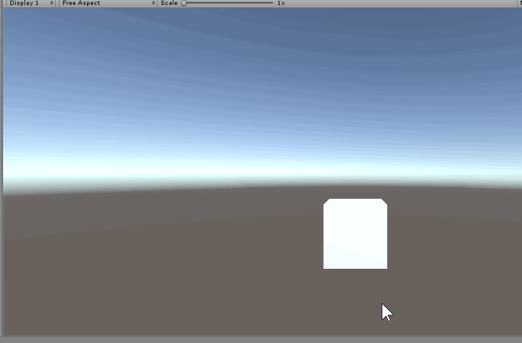

# Console Variable
So it is a simple console variable implement for unity.

## How to use
1. Open **Packages/manifest.json** and add dependency
```json
    "dependencies": {
        "com.whoisfpc.consolevariable": "https://github.com/whoisfpc/com.whoisfpc.consolevariable.git",
    }
```
2. For any static `int` or `float` variables, add below attribute. The CVarAttribute accept two parameters, the first is name for console varialbe, and the second is description for that.
```csharp
using ConsoleVariable;

public class CVarTest : MonoBehaviour
{
    [CVar("cube.scale", "some console varialbe description")]
    static int cubeScale = 1;
}
```
3. For any static method, you can add `CCmd` attribute to add cmd in console. For now, method args type must be `float`, `int`, or `string`. The name of `CCmd` and `CVar` should not same;
```csharp
using ConsoleVariable;

public class CCmdTest : MonoBehaviour
{
    [CCmd("test.hello", "some console command description")]
    static void Hello()
    {
        Debug.Log("Hello!");
    }
}
```
4. You can write your own console gui implement or use my simple gui prefab at **Runtime/Prefabs/ConsoleGUI**

## Simple Console Gui
I made a simple console gui, you can find it at PackageFolder/Runtime/Prefabs/ConsoleGUI. For using it, just drag it to scene. At run time, press **&apos;** key(BackQuote key) to toggle console gui. You can input `CVarName [number]` to set CVar value, or input `CVarName` to see CVar's current value.
You could press **Tab** key to auto complete command.

## Example


## License
This project is licensed under the MIT License - see the **LICENSE.md** file for details
